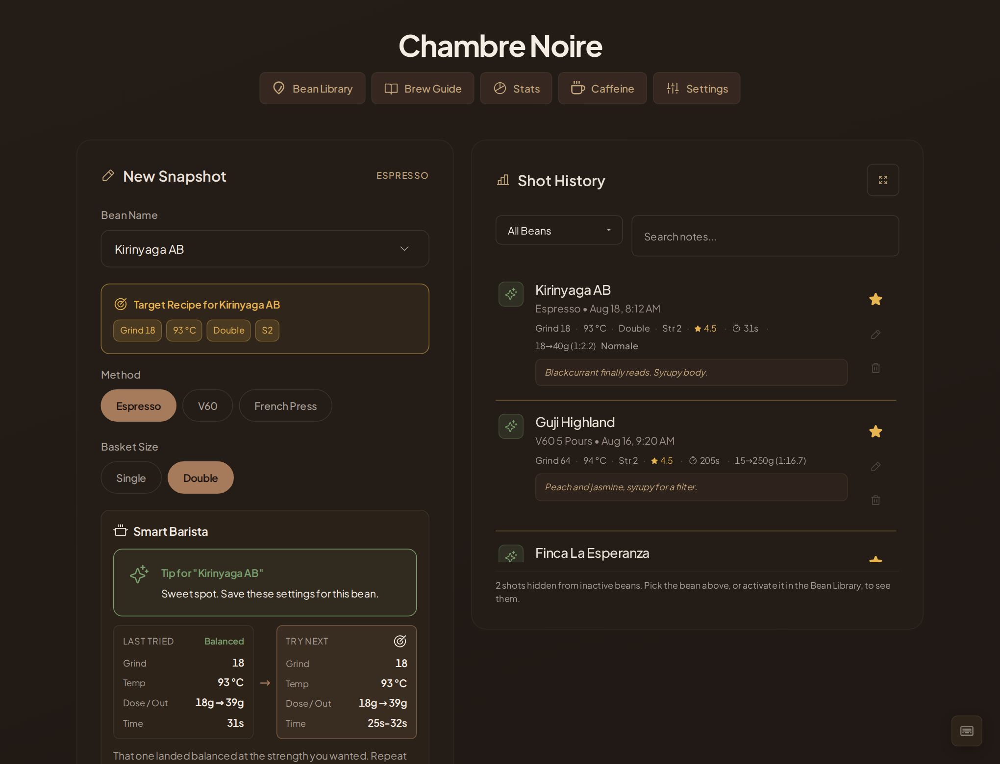

# Chambre Noire

> [!WARNING]
> **Personal project, heavy AI assistance.** This is a hobby web app. It is not
> production software. Use at your own discretion.

A local-first logbook for dialling in coffee. Log espresso shots and filter
brews, track beans, record what you tasted, and get next-shot guidance based on
your own history.

Everything runs in the browser. No account, no backend, no telemetry, no
outbound requests.

## → [Open Chambre Noire](https://labnaud.github.io/Chambre-Noire/)

No install and no sign-up. Add it to your home screen and it works offline.

> [!IMPORTANT]
> Your data lives in your browser's `localStorage`. Clearing browser data or
> switching browsers erases it. Use **Export Backup** in Settings to save a copy.

---



**[Read the walkthrough →](docs/WALKTHROUGH.md)** — every screen, what it does,
and why, illustrated with synthetic demo data.

---

## Features

**Logging**
- Espresso, V60 and French Press, with V60 pour patterns (2 or 5 pours) and an
  iced option that keeps its brew temperature
- Dose, yield, extraction time, grind, and brew water temperature in degrees C
- A 5-point taste rating (sour to bitter) *and* a separate 0-5 quality score
- Free-form tasting notes per brew, and tasting notes per bean *per method*

**Guidance**
- Next-shot suggestions that change one thing at a time: grind for flow, then
  yield for taste, then yield for body. On espresso, temperature is never
  proposed as an adjustment -- only as advice
- An extraction compass plotting each shot by taste and strength, so the walk
  toward the sweet spot is visible
- Roast-based starting points for a bean with no history, with a freshness note
- Best dial-in recall per bean, and a grind-over-time trend sparkline
- Ratio labels (ristretto / normale / lungo) for espresso-style pulls
- Fixed V60 protocols (2 pours, 5 pours, iced) with per-dose pour schedules

**Tracking**
- Bean library with roast-date freshness, bag inventory and cost per shot
- Caffeine forecast using a half-life pharmacokinetic model, with a bedtime
  target and a decay curve; entries are editable and excludable
- Rankings by bean, roaster, variety and origin, and median shots to dial in
- Maintenance reminders for cleaning and descaling

**Data**
- Export to JSON or CSV, import from JSON, with one-click undo
- Six themes, 12- or 24-hour time

## Keyboard shortcuts

| Shortcut | Action |
|----------|--------|
| `Ctrl` + `Enter` | Log the current shot |
| `Ctrl` + `B` | Toggle Bean Library |
| `Ctrl` + `D` | Cycle theme |
| `Esc` | Close any open modal |

---

## Quick start

The hosted copy at <https://labnaud.github.io/Chambre-Noire/> is published from
`main` by [`.github/workflows/pages.yml`](.github/workflows/pages.yml) on every
push, once lint, tests and the build have passed. To run it yourself:

```bash
npm install
npm run dev      # Vite dev server on http://localhost:5173
```

| Command | What it does |
|---|---|
| `npm run dev` | Dev server with hot reload |
| `npm test` | Vitest suite (288 tests) |
| `npm run lint` | ESLint |
| `npm run build` | Type-check, then production build |
| `npm run preview` | Serve the production build locally |

CI runs on Node 22.

### Viewing it from another machine

The dev server binds to `127.0.0.1` only and is not built to face the internet.
To view it from another computer, forward the port over SSH rather than exposing
it:

```bash
ssh -L 5173:localhost:5173 user@your-server -t \
  'cd ~/Chambre-noire && npx vite --port 5173 --strictPort'
```

Then open `http://localhost:5173`. `--strictPort` makes the command fail loudly
instead of quietly moving to another port, which would leave the tunnel pointing
at nothing.

---

## Repository layout

```
src/
  lib/          pure domain logic, no React      <- all tests live here
  hooks/        state + localStorage persistence
  components/   presentational, props-driven
  App.tsx       composition root
  types.ts      the data model
  index.css     design tokens + all styling
scripts/        synthetic demo data + screenshot generation for the docs
```

See **[ARCHITECTURE.md](ARCHITECTURE.md)** for how the layers fit together, what
the data model means, and the invariants worth not breaking.

See **[CONTRIBUTING.md](CONTRIBUTING.md)** for the working conventions: where a
change belongs, how to add a brew method or a drink, and what to run before
committing.

---

## Credits

Chambre Noire is a fork of
[Luxe Cafe Dashboard](https://github.com/Arishawke/luxe_cafe_dashboard) by
[Arishawke](https://github.com/Arishawke), copyright (c) 2026 Arishawke and
licensed under the GNU General Public License v3.

The caffeine half-life model is ported from
[Caffeine-intake](https://github.com/Labnaud/Caffeine-intake).

Changes in this fork are summarised in [CHANGELOG.md](CHANGELOG.md).

## License

[GPL v3](LICENSE). Original work (c) 2026 Arishawke. Modifications (c) 2026 Labnaud.
