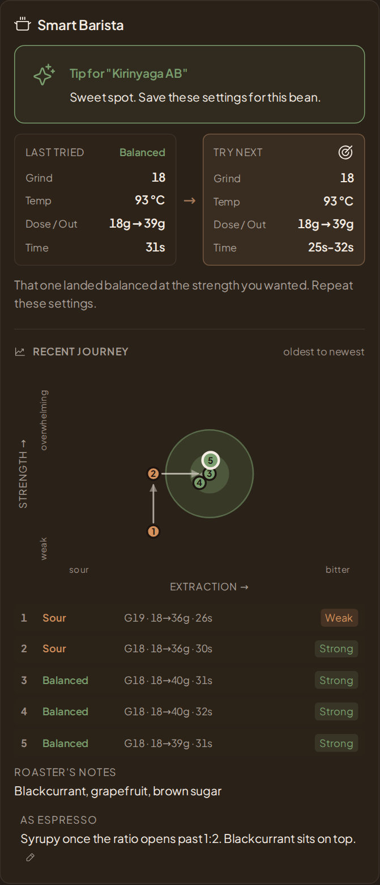
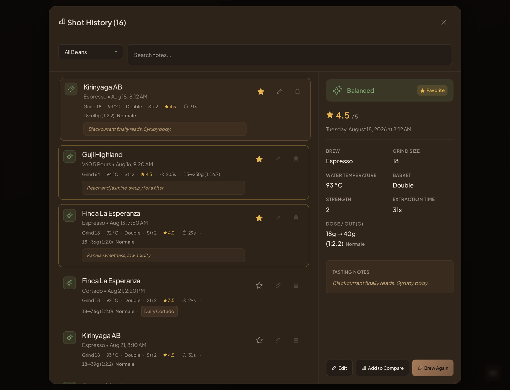
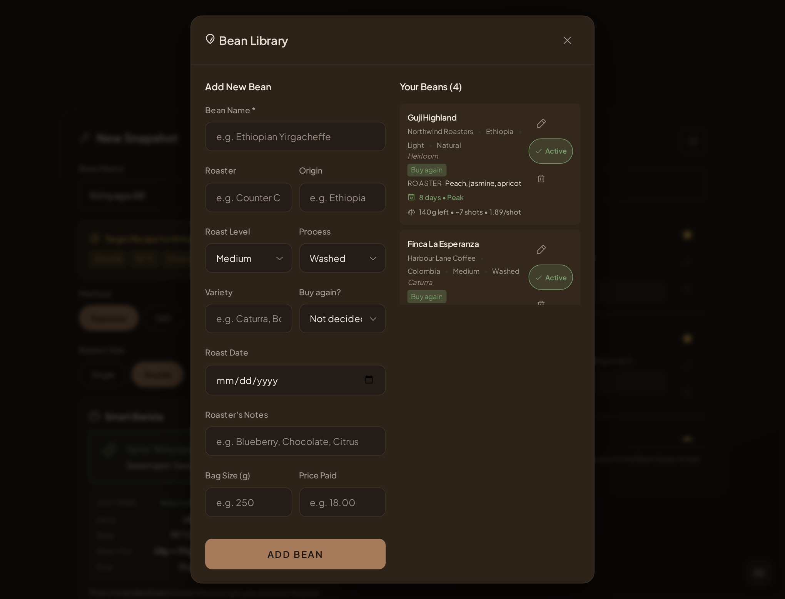
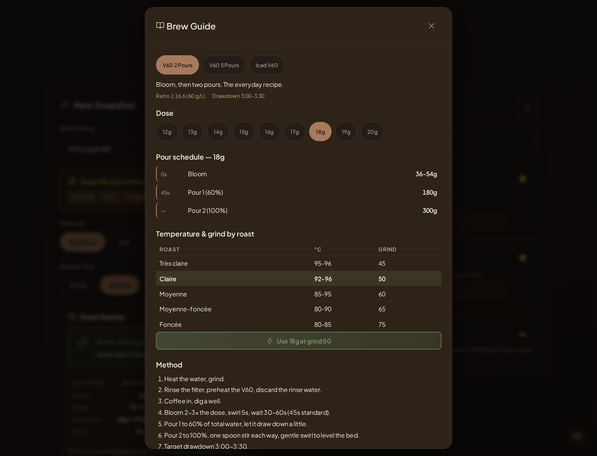
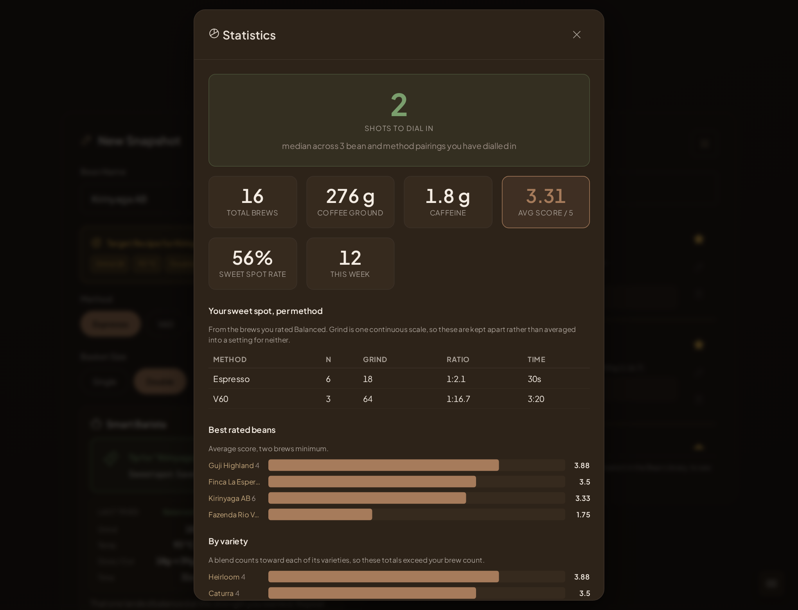
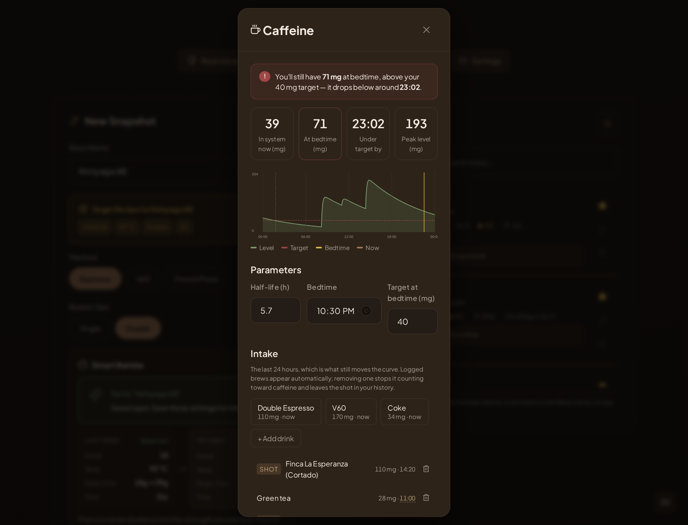
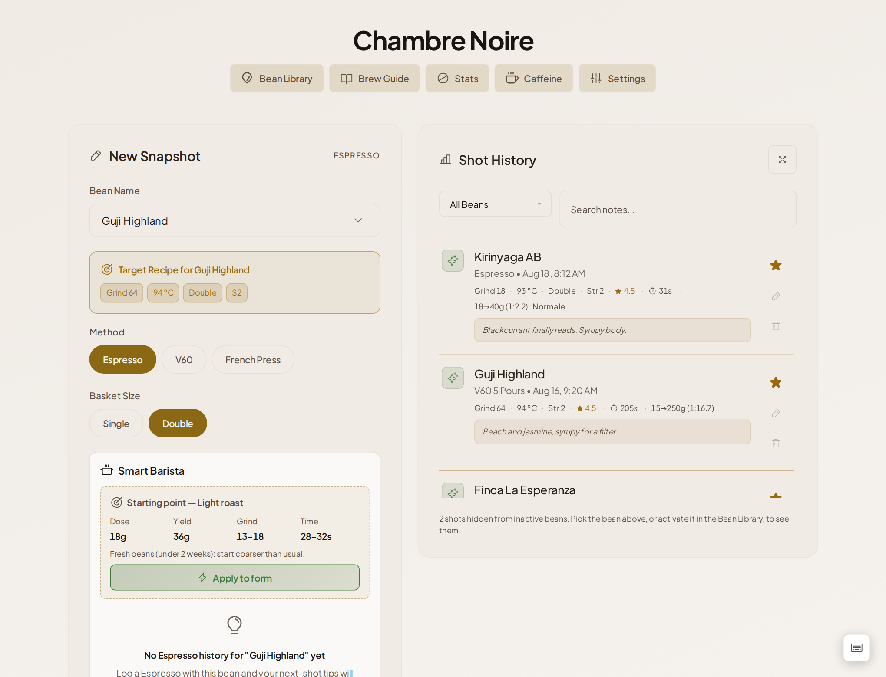
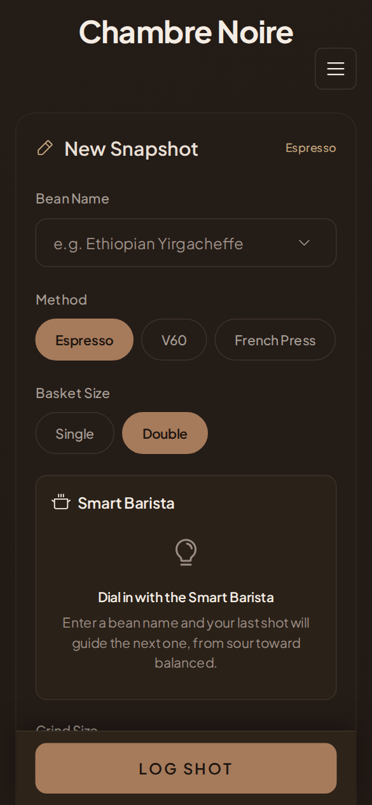

# Chambre Noire — a walkthrough

Every screenshot on this page was taken from a real build of the app running
against **synthetic data**. The beans, roasters and shots are invented for the
documentation; none of it is anyone's logbook. The dataset lives in
[`scripts/demo-seed.mjs`](../scripts/demo-seed.mjs) and the images are
regenerated by [`scripts/demo-screenshots.mjs`](../scripts/demo-screenshots.mjs).

The demo covers four beans and sixteen brews: a Kenyan that took four espresso
shots to dial in, a Colombian that was quick and mostly drunk with milk, an
Ethiopian brewed only as V60, and a Brazilian that never got past bitter and was
retired.

---

## The workspace


One screen, two halves. On the left you log a brew; on the right is everything
you have already logged. There are no pages to navigate between and no save
dialog — the form is the app.

The brew method sits at the top of the form because it changes what the rest of
the form means. Espresso asks for a basket and shows a yield in liquid grams;
V60 asks for a pour pattern and treats yield as total water. Fields that do not
apply to the selected method are not rendered.

Note the line under the history's last entry: **shots from inactive beans are
hidden**. A retired bag stops cluttering the list and stops counting toward
caffeine, without deleting any of its history.

---

## Smart Barista: the dial-in engine



This is the part that does actual work. Enter a bean and it reads your last shot
for that bean and method, then proposes the next one.

The engine changes **one thing at a time, in a fixed order**:

1. **Grind corrects flow.** Under 20s or over 40s it jumps two steps; between
   20 and 28s it moves one; once the shot runs 28–40s the grind is left alone.
2. **Yield corrects taste.** Sour means a longer ratio, bitter a shorter one,
   clamped between 1:1.67 and 1:2.33.
3. **Yield adjusts body**, but only once the taste is already balanced.

**Temperature is never proposed as an espresso adjustment.** It appears only as
advice — a cooling flush after a burnt shot, a longer purge after a sour one.
Filter methods do treat temperature as a lever, because there it is one.

The compass underneath plots the walk. Each dot is a shot, positioned by taste
(sour → bitter) and strength (weak → overwhelming), with arrows in chronological
order and the sweet-spot zone as the green circle. Here shot 1 was sour and weak,
grinding finer moved it up, opening the ratio moved it right, and shots 3–5 sit
in the target. The table below repeats it in numbers so nothing depends on
reading a chart.

---

## Shot history



Every brew is its own record — there is no separate "session" grouping. The
dial-in narrative *is* the history, read in order.

Each row carries the settings that produced the cup: grind, temperature, basket,
strength, score, time, and the dose ratio with its espresso name (`Normale`,
`Ristretto`, `Lungo`). A starred row is the saved recipe for that bean. Milk
drinks show what was built on the shot rather than a set of milk fields.

Two assessments are recorded per brew and they are deliberately separate:

- **Rating** — where the extraction landed on sour ↔ bitter. This drives the
  engine.
- **Score** — how good the cup was, 0–5. This drives the rankings.

Keeping them apart is what stops a technically balanced shot from a dull bean
outranking a bright one from a good bean.

---

## Bean library



Beans carry what the bag says — roaster, origin, variety, process, roast level,
roast date, bag size, price — and the library turns that into two things the bag
does not tell you: **how fresh the bean is right now** (`8 days • Peak`) and
**what a shot of it costs**, derived from bag size and price (`140 g left •
~7 shots • 1.89/shot`).

`Buy again` records the verdict, which is separate from `Active`: the first is
whether you would repurchase, the second whether this bag is in rotation. Making
a bean inactive keeps its history and its statistics while removing it from the
shot form, the caffeine curve, and the history list.

Per-method tasting notes are edited here too, and surface where they are useful —
in Smart Barista, under the roaster's own description.

---

## Brew guide



Fixed V60 recipes rather than generated suggestions: two pours, five pours, and
iced. Pick a dose and the pour schedule is read straight from the table — these
are transcribed values, not interpolations, which is why 14 g takes a different
total on the five-pour than on the two-pour.

The roast rows are in French because they were transcribed verbatim from the
notebook this app replaces.

---

## Statistics



The headline is **median shots to dial in** — the number that tells you whether
you are getting better at this.

Grind is one continuous scale across espresso and filter, so a single average
grind would describe neither. The sweet-spot table is therefore **per method**,
built only from brews rated Balanced. Rankings by bean, roaster, variety and
origin require at least two brews before an entry appears, and a multi-variety
blend counts toward each of its varieties — which is why those totals can exceed
the brew count, as the table says on its face.

---

## Caffeine



A one-compartment pharmacokinetic model — absorption and elimination, not a flat
decay — projecting the curve forward to bedtime and telling you when you will
drop under your target.

Logged brews enter the curve automatically. Anything can be removed from the
calculation without touching your shot history, the time of any entry can be
corrected after the fact, and only active beans contribute. Non-coffee sources
are added from the quick presets.

---

## Themes and mobile



Six themes, all driven by CSS custom properties, so the whole interface repaints
from one set of tokens.

This one also shows what happens with **no history to learn from**. Guji Highland
has only ever been brewed as V60, so asking for an espresso gets a starting point
derived from its roast level rather than a suggestion — plus a freshness note,
because a bean under two weeks off roast wants a coarser grind than the same bean
a month later. The starred V60 recipe still shows at the top as the bean's target.



The layout is built for logging a shot one-handed next to the machine.

---

## Regenerating these images

```bash
npm run build
npx vite preview --port 4173 &
node scripts/demo-screenshots.mjs
```

Playwright's chromium is required but is deliberately **not** a dependency of
this project — install it outside the repo when you need to refresh the images.
